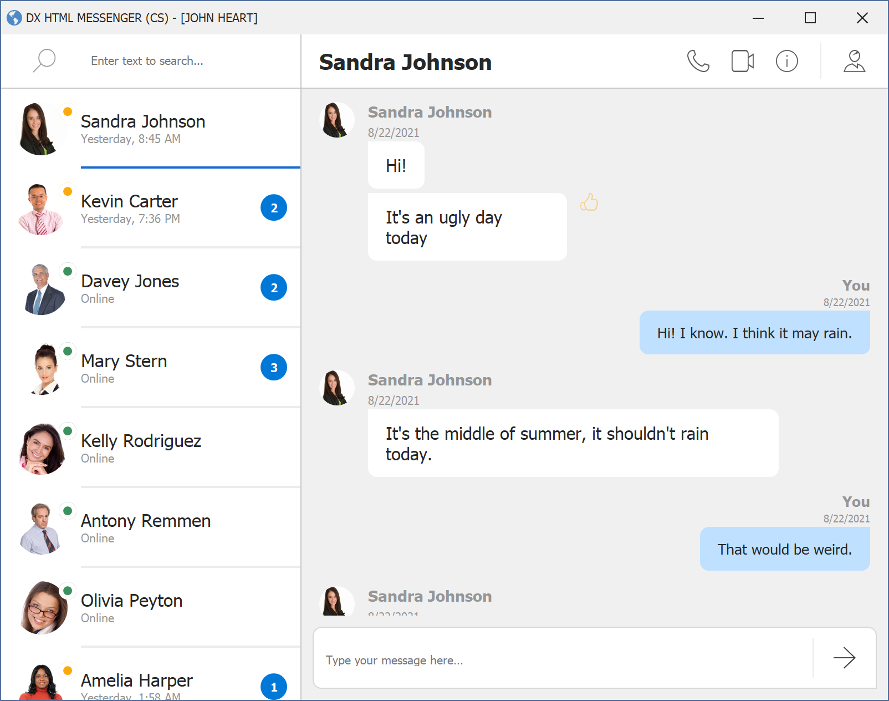

<!-- default badges list -->

<!-- default badges end -->
*Files to look at*:

Model
* [Contact.cs](./Docs/CS/Model/Contact.cs)
* [Message.cs](./Docs/CS/Model/Message.cs)

Data Layer
* [IMessageServer.cs](./Docs/CS/Data/IMessageServer.cs)
* [ChannelEvent.cs](./Docs/CS/Data/Events/ChannelEvent.cs)
* [ContactEvents.cs](./Docs/CS/Data/Events/ContactEvents.cs)
* [MessageEvents.cs](./Docs/CS/Data/Events/MessageEvents.cs)
* [ChannelCommands.cs](./Docs/CS/Data/Commands/ChannelCommands.cs)
* [ContactCommands.cs](./Docs/CS/Data/Commands/ContactCommands.cs)
* [MessageCommands.cs](./Docs/CS/Data/Commands/MessageCommands.cs)

User Interface
* [Messenger.cs](./CS/Messenger.cs) & [MessengerViewModel.cs](./CS/ViewModels/MessengerViewModel.cs)
* [ContactsView.cs](./CS/Views/ContactsView.cs) & [ContactsViewModel.cs](./CS/ViewModels/ContactsViewModel.cs)
* [MessagesView.cs](./CS/Views/MessagesView.cs) & [MessagesViewModel.cs](./CS/ViewModels/MessagesViewModel.cs)

<!-- default file list end -->

# DXHtmlMessenger

DXHtmlMessenger emulates a messenger application for desktop. 

## UI based on HTML and CSS

Different parts of the application are built based on the DevExpress controls that render a UI from HTML and CSS. The image below demonstrates the main form.

The main form's UI is built from the following DevExpress controls:

- **HtmlContentControl** — Uses HTML and CSS to present data from a data context (for instance, a database). Support input boxes.
- Data Grid's **TileView** — Allows you to render its tiles from a specific template in HTML format, and apply CSS styles to tile elements.
- Data Grid's **ItemsView** — Renders its items from HTML templates and CSS styles.

Information on users is shown in popup windows encapsulated by **HtmlContentPopup** components. These popup windows also render their contents from HTML and CSS.

You can find the HTML code and CSS styles from which controls are rendered in the _Assets/HTML_ and _Assets/CSS_ folders.

See the following page for more information: [Application UI](./Docs/ApplicationPartsDesign.md)

## Application Layers   
The app uses the [MVVM pattern](https://docs.devexpress.com/WindowsForms/113955/build-an-application/winforms-mvvm) to separate the code into layers — Data Layer, Model and View (UI). This separation grants you multiple benefits, such as a more independent development process for both developers and designers, easier code testing, and simpler UI redesigns.
  
The example shows how to provide data to Views, handle user actions, and interact with the server (send and listen to commands). The data layer is implemented as in-memory storage that reads/writes data to the sample DevAV data base. 
  To communicate with various messengers (WhatsApp, Twitter, Telegram, etc.), you only need to replace this data layer with your own one. No need to change the Model and UI layers, as they interact with the data layer using an interface.
  
See the following page for more information: [Work with data](./Docs/HowItWorksWithData.md)
