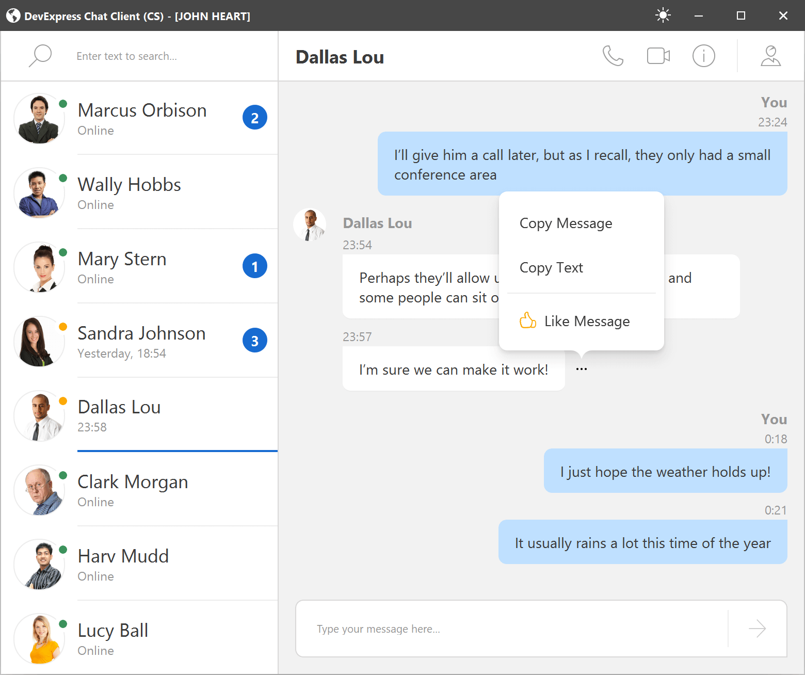
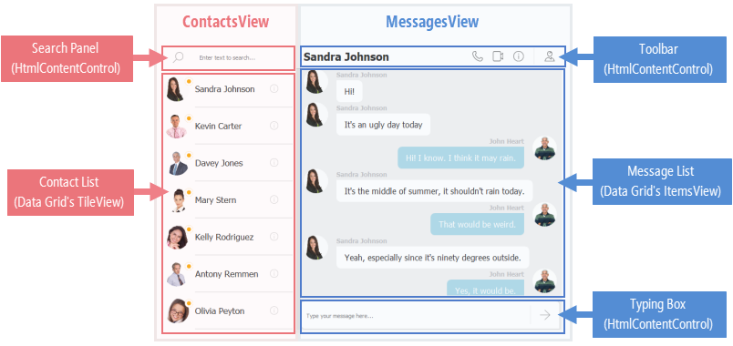

<!-- default badges list -->

<!-- default badges end -->

# WinForms Chat Client Demo (DXHtmlMessenger)

DXHtmlMessenger is a Windows Forms demo that emulates a messenger app. It shows how to use DevExpress WinForms controls to build a desktop UI from HTML and CSS.

<!-- default file list --> 
## Files to Look At

Model
* [Contact.cs](./Docs/CS/Model/Contact.cs) ([Contact.vb](./Docs/VB/Model/Contact.vb))
* [Message.cs](./Docs/CS/Model/Message.cs) ([Message.vb](./Docs/VB/Model/Message.vb))

Data Layer
* [IMessageServer.cs](./Docs/CS/Data/IMessageServer.cs) ([IMessageServer.vb](./Docs/VB/Data/IMessageServer.vb))
* [ChannelEvent.cs](./Docs/CS/Data/Events/ChannelEvent.cs) ([ChannelEvent.vb](./Docs/VB/Data/Events/ChannelEvent.vb))
* [ContactEvents.cs](./Docs/CS/Data/Events/ContactEvents.cs) ([ContactEvents.vb](./Docs/VB/Data/Events/ContactEvents.vb))
* [MessageEvents.cs](./Docs/CS/Data/Events/MessageEvents.cs) ([MessageEvents.vb](./Docs/VB/Data/Events/MessageEvents.vb))
* [ChannelCommands.cs](./Docs/CS/Data/Commands/ChannelCommands.cs) ([ChannelCommands.vb](./Docs/VB/Data/Commands/ChannelCommands.vb))
* [ContactCommands.cs](./Docs/CS/Data/Commands/ContactCommands.cs) ([ContactCommands.vb](./Docs/VB/Data/Commands/ContactCommands.vb))
* [MessageCommands.cs](./Docs/CS/Data/Commands/MessageCommands.cs) ([MessageCommands.vb](./Docs/VB/Data/Commands/MessageCommands.vb))

User Interface
* [Messenger.cs](./CS/Messenger.cs) & [MessengerViewModel.cs](./CS/ViewModels/MessengerViewModel.cs) ([Messenger.vb](./VB/Messenger.vb) & [MessengerViewModel.vb](./VB/ViewModels/MessengerViewModel.vb))
* [ContactsView.cs](./CS/Views/ContactsView.cs) & [ContactsViewModel.cs](./CS/ViewModels/ContactsViewModel.cs) ([ContactsView.vb](./VB/Views/ContactsView.vb) & [ContactsViewModel.vb](./VB/ViewModels/ContactsViewModel.vb))
* [MessagesView.cs](./CS/Views/MessagesView.cs) & [MessagesViewModel.cs](./CS/ViewModels/MessagesViewModel.cs) ([MessagesView.vb](./VB/Views/MessagesView.vb) & [MessagesViewModel.vb](./VB/ViewModels/MessagesViewModel.vb))

<!-- default file list end -->

## Desktop UI based on HTML and CSS

DXHtmlMessenger is built based on the DevExpress controls that render a UI from HTML and CSS. The image below demonstrates the main form.

The form's GUI is set up using the following DevExpress controls:

- [HtmlContentControl](https://docs.devexpress.com/WindowsForms/DevExpress.XtraEditors.HtmlContentControl) — Renders a UI from an HTML-CSS template. Can show data from a bound data context (a business object or data source item). The HTML code can contain the `input` tag, which defines a placeholder for any external control (for instance, a text box). 
- Data Grid's [TileView](https://docs.devexpress.com/WindowsForms/114728/controls-and-libraries/data-grid/views/tile-view) — Allows you to render its tiles from a specific template in HTML format, and apply CSS styles to tile elements.
- Data Grid's [ItemsView](https://docs.devexpress.com/WindowsForms/DevExpress.XtraGrid.Views.Items.ItemsView) — Presents records from a data source as an item list. Each list item is rendered using an HTML-CSS template.

The app demonstrates the [HtmlContentPopup](https://docs.devexpress.com/WindowsForms/DevExpress.XtraEditors.HtmlContentPopup) component used to show specific information in popup windows (information about users and popup menus). This component also renders a UI from an HTML-CSS template. It can also show data from a bound data context (a business object or data source item).

You can find the HTML code and CSS styles from which controls render UIs in the project's _Assets/HTML_ and _Assets/CSS_ folders.

HTML-based UI rendering supports DirectX hardware acceleration. See the following topic to learn how to enable the DirectX engine: [DirectX Hardware Acceleration](https://docs.devexpress.com/WindowsForms/119441/common-features/graphics-performance-and-high-dpi/directx-hardware-acceleration).

See the following page for more information on how the application's UI is built: [Application UI Design](./Docs/ApplicationPartsDesign.md)

## Application Layers   
The app uses the [MVVM pattern](https://docs.devexpress.com/WindowsForms/113955/build-an-application/winforms-mvvm) to separate the code into layers — Data Layer, Model, and View (UI). This separation grants you multiple benefits, such as a more independent development process for both developers and designers, easier code testing, and simpler UI redesigns. The data layer uses a set of interfaces to interact with the Model and UI layers.
  
The example shows how to supply data to Views, handle user actions, and interact with the server (send and listen to commands). The current implementation of the data layer is in-memory storage that gets data from the sample DevAV database. 
To communicate with any messenger app, you can replace the current implementation of the data layer with your own implementation. Modification of other layers is required if you want to extend text messaging with advanced features, like image and video support, calls, group chats, etc.
  
See the following page for more information: [Work with data](./Docs/HowItWorksWithData.md)

## Documentation

- [HTML and CSS-based Desktop UI](https://docs.devexpress.com/WindowsForms/403397/common-features/html-css-based-desktop-ui)
- [HTML Tags](https://docs.devexpress.com/WindowsForms/403398/common-features/html-css-based-desktop-ui/html-tags?v=21.2)
- [CSS Styles](https://docs.devexpress.com/WindowsForms/403399/common-features/html-css-based-desktop-ui/css-styles?v=21.2)
<!-- feedback -->
## Does this example address your development requirements/objectives?

 

(you will be redirected to DevExpress.com to submit your response)
<!-- feedback end -->
